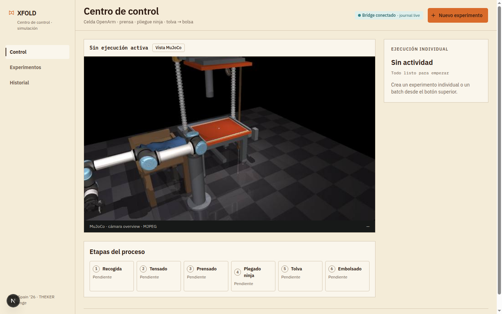
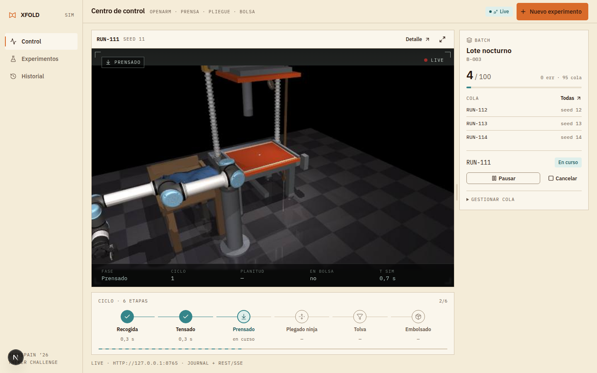
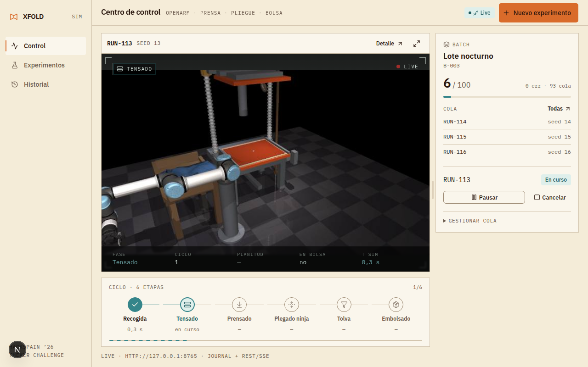
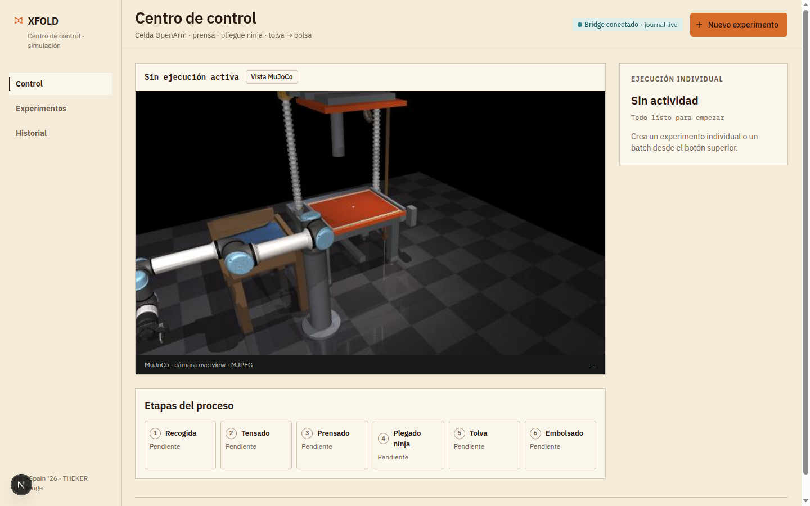
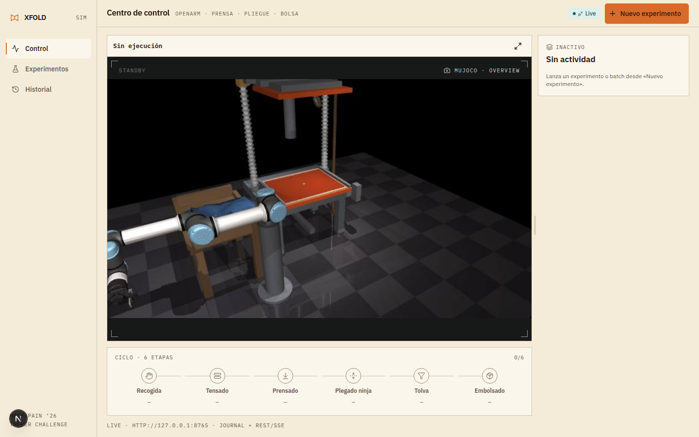
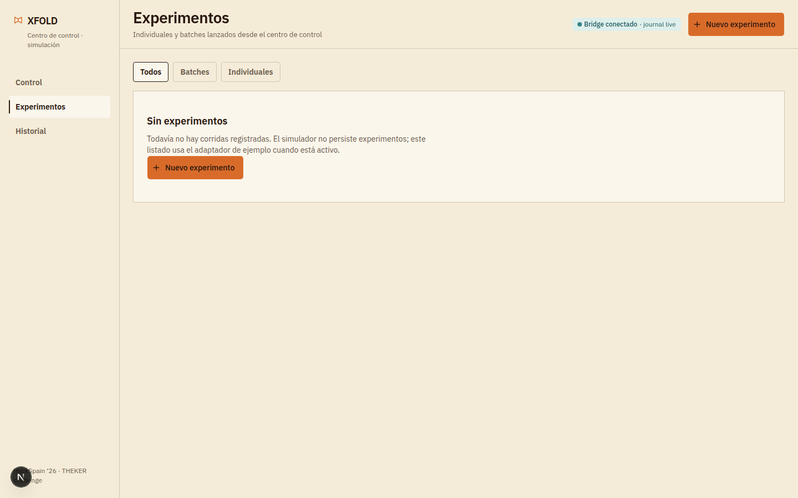
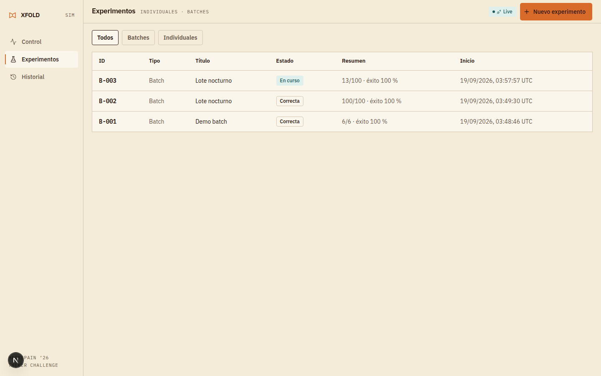
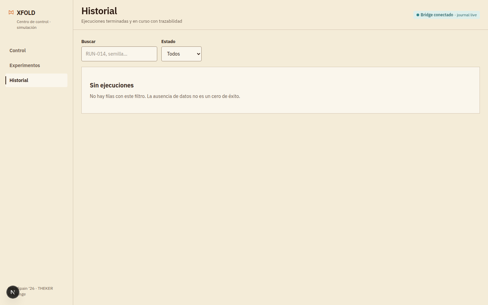
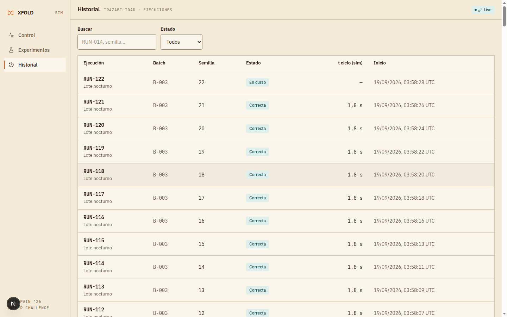

# UI review — control room refinement

Capturas antes/después usadas como evidencia visual del PR de refinamiento de UI (1440×900 y 1280×800, bridge live con batch activo).

### Antes / después — Control (1440×900, batch activo)

| Antes | Después |
|---|---|
|  |  |

### Control — 1280×800 (después, sin scroll)

### Control — sin ejecución (antes / después)

| Antes | Después |
|---|---|
|  |  |

### Experimentos / Historial

| Antes | Después |
|---|---|
|  |  |
|  |  |
